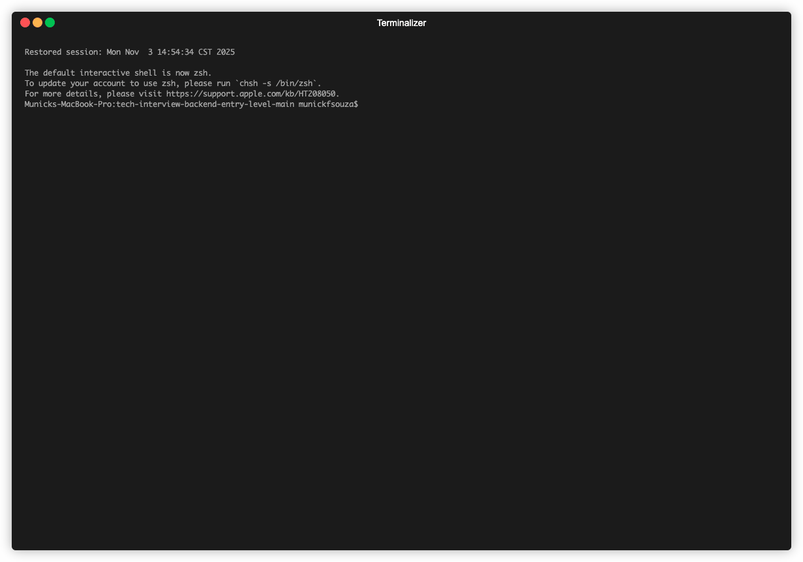

# Desafio técnico e-commerce

## Nossas expectativas

A equipe de engenharia da RD Station tem alguns princípios nos quais baseamos nosso trabalho diário. Um deles é: projete seu código para ser mais fácil de entender, não mais fácil de escrever.

Portanto, para nós, é mais importante um código de fácil leitura do que um que utilize recursos complexos e/ou desnecessários.

O que gostaríamos de ver:

- O código deve ser fácil de ler. Clean Code pode te ajudar.
- Notas gerais e informações sobre a versão da linguagem e outras informações importantes para executar seu código.
- Código que se preocupa com a performance (complexidade de algoritmo).
- O seu código deve cobrir todos os casos de uso presentes no README, mesmo que não haja um teste implementado para tal.
- A adição de novos testes é sempre bem-vinda.
- Você deve enviar para nós o link do repositório público com a aplicação desenvolvida (GitHub, BitBucket, etc.).

## O Desafio - Carrinho de compras
O desafio consiste em uma API para gerenciamento do um carrinho de compras de e-commerce.

Você deve desenvolver utilizando a linguagem Ruby e framework Rails, uma API Rest que terá 3 endpoins que deverão implementar as seguintes funcionalidades:

### 1. Registrar um produto no carrinho
Criar um endpoint para inserção de produtos no carrinho.

Se não existir um carrinho para a sessão, criar o carrinho e salvar o ID do carrinho na sessão.

Adicionar o produto no carrinho e devolver o payload com a lista de produtos do carrinho atual.


ROTA: `/cart`
Payload:
```js
{
  "product_id": 345, // id do produto sendo adicionado
  "quantity": 2, // quantidade de produto a ser adicionado
}
```

Response
```js
{
  "id": 789, // id do carrinho
  "products": [
    {
      "id": 645,
      "name": "Nome do produto",
      "quantity": 2,
      "unit_price": 1.99, // valor unitário do produto
      "total_price": 3.98, // valor total do produto
    },
    {
      "id": 646,
      "name": "Nome do produto 2",
      "quantity": 2,
      "unit_price": 1.99,
      "total_price": 3.98,
    },
  ],
  "total_price": 7.96 // valor total no carrinho
}
```

### 2. Listar itens do carrinho atual
Criar um endpoint para listar os produtos no carrinho atual.

ROTA: `/cart`

Response:
```js
{
  "id": 789, // id do carrinho
  "products": [
    {
      "id": 645,
      "name": "Nome do produto",
      "quantity": 2,
      "unit_price": 1.99, // valor unitário do produto
      "total_price": 3.98, // valor total do produto
    },
    {
      "id": 646,
      "name": "Nome do produto 2",
      "quantity": 2,
      "unit_price": 1.99,
      "total_price": 3.98,
    },
  ],
  "total_price": 7.96 // valor total no carrinho
}
```

### 3. Alterar a quantidade de produtos no carrinho 
Um carrinho pode ter _N_ produtos, se o produto já existir no carrinho, apenas a quantidade dele deve ser alterada

ROTA: `/cart/add_item`

Payload
```json
{
  "product_id": 1230,
  "quantity": 1
}
```
Response:
```json
{
  "id": 1,
  "products": [
    {
      "id": 1230,
      "name": "Nome do produto X",
      "quantity": 2, // considerando que esse produto já estava no carrinho
      "unit_price": 7.00, 
      "total_price": 14.00, 
    },
    {
      "id": 01020,
      "name": "Nome do produto Y",
      "quantity": 1,
      "unit_price": 9.90, 
      "total_price": 9.90, 
    },
  ],
  "total_price": 23.9
}
```

### 3. Remover um produto do carrinho 

Criar um endpoint para excluir um produto do do carrinho. 

ROTA: `/cart/:product_id`


#### Detalhes adicionais:

- Verifique se o produto existe no carrinho antes de tentar removê-lo.
- Se o produto não estiver no carrinho, retorne uma mensagem de erro apropriada.
- Após remover o produto, retorne o payload com a lista atualizada de produtos no carrinho.
- Certifique-se de que o endpoint lida corretamente com casos em que o carrinho está vazio após a remoção do produto.

### 5. Excluir carrinhos abandonados
Um carrinho é considerado abandonado quando estiver sem interação (adição ou remoção de produtos) há mais de 3 horas.

- Quando este cenário ocorrer, o carrinho deve ser marcado como abandonado.
- Se o carrinho estiver abandonado há mais de 7 dias, remover o carrinho.
- Utilize um Job para gerenciar (marcar como abandonado e remover) carrinhos sem interação.
- Configure a aplicação para executar este Job nos períodos especificados acima.

### Detalhes adicionais:
- O Job deve ser executado regularmente para verificar e marcar carrinhos como abandonados após 3 horas de inatividade.
- O Job também deve verificar periodicamente e excluir carrinhos que foram marcados como abandonados por mais de 7 dias.

### Como resolver

#### Implementação
Você deve usar como base o código disponível nesse repositório e expandi-lo para que atenda as funcionalidade descritas acima.

Há trechos parcialmente implementados e também sugestões de locais para algumas das funcionalidades sinalizados com um `# TODO`. Você pode segui-los ou fazer da maneira que julgar ser a melhor a ser feita, desde que atenda os contratos de API e funcionalidades descritas.

#### Testes
Existem testes pendentes, eles estão marcados como <span style="color:green;">Pending</span>, e devem ser implementados para garantir a cobertura dos trechos de código implementados por você.
Alguns testes já estão passando e outros estão com erro. Com a sua implementação os testes com erro devem passar a funcionar. 
A adição de novos testes é sempre bem-vinda, mas sem alterar os já implementados.


### O que esperamos
- Implementação dos testes faltantes e de novos testes para os métodos/serviços/entidades criados
- Construção das 4 rotas solicitadas
- Implementação de um job para controle dos carrinhos abandonados


### Itens adicionais / Legais de ter
- Utilização de factory na construção dos testes
- Desenvolvimento do docker-compose / dockerização da app

A aplicação já possui um Dockerfile, que define como a aplicação deve ser configurada dentro de um contêiner Docker. No entanto, para completar a dockerização da aplicação, é necessário criar um arquivo `docker-compose.yml`. O arquivo irá definir como os vários serviços da aplicação (por exemplo, aplicação web, banco de dados, etc.) interagem e se comunicam.

- Adicione tratamento de erros para situações excepcionais válidas, por exemplo: garantir que um produto não possa ter quantidade negativa. 

- Se desejar você pode adicionar a configuração faltante no arquivo `docker-compose.yml` e garantir que a aplicação rode de forma correta utilizando Docker. 

## Informações técnicas

### Dependências
- ruby 3.3.1
- rails 7.1.3.2
- postgres 16
- redis 7.0.15

### Como executar o projeto

## Executando a app sem o docker
Dado que todas as as ferramentas estão instaladas e configuradas:

Instalar as dependências do:
```bash
bundle install
```

Executar o sidekiq:
```bash
bundle exec sidekiq
```

Executar projeto:
```bash
bundle exec rails server
```

Executar os testes:
```bash
bundle exec rspec
```

### Como enviar seu projeto
Salve seu código em um versionador de código (GitHub, GitLab, Bitbucket) e nos envie o link publico. Se achar necessário, informe no README as instruções para execução ou qualquer outra informação relevante para correção/entendimento da sua solução.


# 🧠 RD Station E-commerce Challenge 2024  
### Desenvolvido por [Munick Nayara Freitas de Souza] 
📍 Saskatoon – SK, Canadá  
🌐 [github.com/municksouza](https://github.com/municksouza)

---


---

## 🎯 Descrição Geral (Português)

Este projeto implementa uma **API RESTful completa** e uma **interface de demonstração interativa (frontend)** para um sistema de **carrinho de compras** em e-commerce.  
Desenvolvido como parte do **Desafio Técnico RD Station 2024**, o foco principal foi **clareza, escalabilidade, performance e qualidade de código.**

---

## 🚀 Stack Técnica

| Camada | Tecnologia |
|--------|-------------|
| **Backend** | Ruby on Rails 7.1 (API-only) |
| **Banco de Dados** | PostgreSQL 16 |
| **Jobs / Background** | Redis 7 + Sidekiq + Sidekiq-Cron |
| **Testes** | RSpec + FactoryBot |
| **Infraestrutura** | Docker Compose |
| **Frontend Demo** | HTML5 + CSS3 + JavaScript (esbuild) |

---

## ⚙️ Arquitetura da Solução

- **Rails API-only:** estrutura limpa, voltada para performance.  
- **Sidekiq + Cron:** marca carrinhos inativos (>3h) e remove após 7 dias.  
- **Session-based Cart:** persistência via cookies simulando sessão do usuário.  
- **Validações atômicas:** garantem consistência ao adicionar/remover itens.  
- **Enums inteligentes:** status `active`, `abandoned` e `expired`.  
- **Transações ActiveRecord:** evitam inconsistências no banco.  

---

## 🔍 Endpoints Principais

| Método | Rota | Descrição |
|--------|------|-----------|
| `POST /api/cart` | Cria o carrinho (caso não exista). |
| `POST /api/cart/add_item` | Adiciona ou atualiza produto no carrinho. |
| `GET /api/cart` | Retorna os produtos e o total do carrinho. |
| `DELETE /api/cart/:product_id` | Remove um produto específico. |
| **Sidekiq Cron Job** | Marca como “abandonado” (>3h) e remove (>7 dias). |

---

## 🧩 Testes e Qualidade

✅ **32 testes RSpec — 0 falhas (100% passing)**  
📦 Cobertura completa: models, controllers, rotas e integração.

### Estrutura de Testes
spec/
├── models/
├── requests/
├── routing/
├── support/
└── factories/


**Ferramentas utilizadas:**
- RSpec (testes automatizados)
- FactoryBot (geração de dados)
- Support Helpers (testes mais limpos e rápidos)

---

## 🧪 Testes via cURL

Os testes manuais do carrinho foram realizados com `curl`, utilizando **cookies persistentes** e verificação das rotas REST.

### 💡 Como testar

#### 1️⃣ Crie o arquivo de cookies

touch cookies.txt

2️⃣ Adicione um produto ao carrinho

curl -X POST http://localhost:3000/api/cart/add_item \
  -H "Content-Type: application/json" \
  -d '{"product_id": 1, "quantity": 2}' \
  -c cookies.txt

3️⃣ Consulte o carrinho

curl -X GET http://localhost:3000/api/cart -b cookies.txt

4️⃣ Remova um produto

curl -X DELETE http://localhost:3000/api/cart/1 -b cookies.txt

🖼️ Demonstração dos testes via Terminal (GIF)

O GIF abaixo mostra o fluxo completo — criação, listagem e remoção de produtos via cURL, com persistência de cookies e execução de jobs automáticos no Sidekiq.

<p align="center">  </p>

## 🎨 Demonstração Completa (API + Frontend)

### 🎥 Vídeo de Demonstração

<video src="demo_cart.mp4" width="700" controls autoplay loop muted></video>

Localizado em **`/public/demo`**, o frontend conecta-se à API e simula uma experiência real de loja online.

**Funcionalidades:**
- Listagem de produtos dinâmica  
- Carrinho lateral com total em tempo real  
- Botão “⬅ Voltar” interativo  
- Layout responsivo e moderno  

**Principais arquivos:**
public/demo/index.html
public/demo/styles/base.css
public/demo/styles/components.css
public/demo/dist/bundle.js


## 🐳 Execução via Docker Compose

docker-compose up --build
Serviço	Descrição
web	Rails API
db	PostgreSQL
redis	Redis
test	Ambiente RSpec isolado

🧭 Execução Local (sem Docker)

bundle install
bundle exec rails db:prepare
bundle exec sidekiq
bundle exec rails s
bundle exec rspec
⏰ Cron Jobs — Sidekiq
config/sidekiq.yml:

yaml

:schedule:
  mark_carts_as_abandoned_job:
    cron: "*/30 * * * *"
    class: "MarkCartAsAbandonedJob"
Responsabilidades do Job:

Marcar carrinhos inativos (>3h)

Excluir carrinhos abandonados (>7 dias)

🔐 Segurança e Boas Práticas
.env para credenciais e chaves sensíveis

Cookies de sessão seguros

Validações de quantidade mínima (≥ 1)

Proteção CSRF e headers seguros

📈 Resultados e Conclusão
✅ API RESTful funcional
✅ Cron jobs automatizados
✅ Testes com 100% de sucesso
✅ Frontend responsivo integrado
✅ Docker Compose completo

Projeto desenvolvido com foco em clareza, performance e escalabilidade, refletindo as boas práticas de engenharia esperadas pela equipe da RD Station.

🧑‍💻 Autoria
Munick Nayara Freitas de Souza
📍 Saskatoon – SK, Canadá
🌐 github.com/municksouza


🌍 English Version
🧠 RD Station E-commerce Challenge 2024
Developed by Munick Nayara Freitas de Souza
📍 Saskatoon – SK, Canada
🌐 github.com/municksouza


🎯 Overview

This project implements a complete RESTful API and a frontend demo for an e-commerce shopping cart system.
Built for the RD Station Technical Challenge 2024, focusing on clarity, performance, and clean code.

🚀 Tech Stack

Layer	Technology
Backend	Ruby on Rails 7.1 (API-only)
Database	PostgreSQL 16
Background Jobs	Redis 7 + Sidekiq + Sidekiq-Cron
Testing	RSpec + FactoryBot
Infrastructure	Docker Compose
Frontend Demo	HTML5 + CSS3 + JavaScript (esbuild)

⚙️ Architecture
Clean API-only Rails structure

Background jobs with Sidekiq Cron

Session-based cart management

Atomic validations and transactions

Enum statuses (active, abandoned, expired)

Scalable, containerized environment

🔍 Main Endpoints
Method	Route	Description
POST /api/cart	Creates a cart if none exists.	
POST /api/cart/add_item	Adds or updates product in cart.	
GET /api/cart	Lists all products and total.	
DELETE /api/cart/:product_id	Removes product from cart.	
Sidekiq Cron	Marks as abandoned (>3h) and deletes (>7 days).	

🧩 Testing
✅ 32 RSpec examples — 0 failures
Full coverage on models, controllers, and integration.

bundle exec rspec

🎨 Full Demonstration

🖼️ Terminal test demonstration (GIF)

The GIF below demonstrates the full flow — creating, listing, and removing products via cURL, using persistent cookies and automatic Sidekiq job execution.

<p align="center">  </p>

🎥 Demo Video
<video src="demo_cart.mp4" width="700" controls autoplay loop muted></video>

Demonstration using curl, persistent session cookies, and live Sidekiq job execution, alongside a responsive frontend simulation.

💻 Frontend Demo
Path: /public/demo

Includes:

Product listing

Interactive side cart

Real-time total updates

“⬅ Back” navigation

Responsive design

🐳 Docker Setup

docker-compose up --build
Service	Description
web	Rails API
db	PostgreSQL
redis	Redis
test	RSpec environment

⏰ Cron Jobs

:schedule:
  mark_carts_as_abandoned_job:
    cron: "*/30 * * * *"
    class: "MarkCartAsAbandonedJob"
Runs every 30 minutes to mark inactive carts and purge abandoned ones.

📈 Results
✅ 100% passing tests
✅ Functional REST API
✅ Real-time job scheduling
✅ Responsive demo UI
✅ Full Docker setup

👩‍💻 Author
Munick Nayara Freitas de Souza
📍 Saskatoon – SK, Canada
🌐 github.com/municksouza

